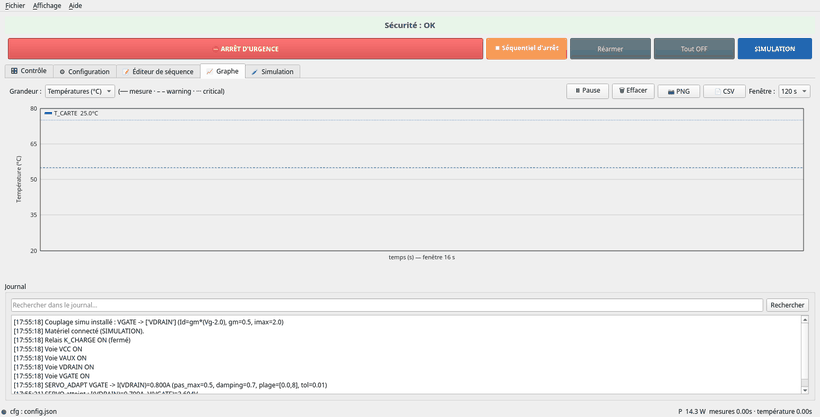

**Français** · [English](README.md)

# Séquenceur d'alimentation — R&S HMP + acquisition National Instruments

Application Python pour **séquencer l'alimentation d'une carte électronique** en toute
**sûreté** : pilotage de voies (R&S HMP40xx / 20xx en **SCPI**), **asservissement**
tension → courant, mesure de **température** (module NI), **sécurité thermique**,
enregistrement et **rapport d'essai**. IHM **Qt** (PySide6), **bilingue FR/EN**.
Fonctionne en **simulation** (sans matériel) comme sur **matériel réel** — le même code.

> ⚠️ **Sûreté.** Ce logiciel pilote des **alimentations de puissance** : ses
> protections sont **logicielles** et ne remplacent pas un dispositif de sûreté
> matériel ni le jugement de l'opérateur. Fourni **sans garantie** (GPL‑3.0), **non
> certifié**, usage **à vos propres risques**. Raccordez les instruments sur un
> **réseau de banc isolé** (SCPI/TCPIP est sans authentification). Voir
> [SECURITY.md](SECURITY.md).

## Aperçu

<p align="center"></p>

> **Sécurité en action** *(simulation)* — la carte chauffe sous puissance, la
> surveillance franchit le seuil d'**alerte**, puis au **critique** la
> **désalimentation de sécurité** se déclenche (bannière rouge) et la température
> retombe. Aucun matériel requis.

<p align="center"></p>

> Onglet **Contrôle** — voies d'alimentation et groupe série, surveillance de
> température (seuils), **barre de sécurité permanente** (arrêt d'urgence, séquentiel
> d'arrêt, réarmer), badge de mode et journal. *(scénario de simulation)*

<p align="center"></p>

> Onglet **Graphe** — courbes temps réel commutables **°C / A / V**, seuils
> alerte/critique, **curseur de lecture** des valeurs, repères d'événements, export
> **PNG / CSV**.

<p align="center"></p>

> Onglet **Éditeur de séquence** — coloration syntaxique, **lint en direct**
> (✓/✗ + ligne fautive), auto‑complétion et palette de commandes cliquable.

## Fonctionnalités

- **Voies d'alimentation** — réglage tension / limite de courant, ON/OFF, **groupes
  en série**, rails négatifs, labels (`VCC`, `VDRAIN`…).
- **Asservissement** (servo) — règle une voie jusqu'à un **courant cible** mesuré sur
  une autre, à pas fixe ou **adaptatif** (sécante/Newton).
- **Sécurité thermique** — seuils alerte/critique par capteur ; au critique,
  **désalimentation ordonnée** (extinction douce), **coupure dure** en dernier
  recours, **arrêt d'urgence**, état verrouillé jusqu'au réarmement.
- **Températures** — conversion tension → °C (table, polynôme, NTC, PTC/RTD,
  thermocouple K/J) avec **détection de capteur en défaut**.
- **Séquences** `.seq` (une action par ligne : `SET`, `ON/OFF`, `WAIT`, `RAMP`,
  `SERVO`, `WAIT_CURRENT/TEMP`, `RELAY`, `REPEAT`…) — éditeur intégré avec **lint en
  direct** et auto‑complétion.
- **Relais / actionneurs** et **couplages** simulés (tester un servo sans matériel).
- **Traçabilité** — dossiers d'essai autonomes (CSV + config + séquence + journal),
  **rapport PDF régénérable**, **relecture** et **comparaison** d'essais.
- **Assistant de configuration** — simulation, scan VISA, saisie d'adresse manuelle.
- **Bilingue** — français / anglais, sélectionnable dans *Affichage → Langue*.
- **Parité simulation / réel** — mocks fidèles (modèle thermique, charges, couplages).

## Démarrage

```bash
pip install -r requirements-qt.txt    # IHM Qt — requise, même en simulation
python3 main.py                        # démarre en simulation (config + séquences de démo)

pip install -r requirements.txt        # + pilotes MATÉRIEL RÉEL (pyvisa, nidaqmx)
python3 main.py --config config.json   # passer "simulate": false dans le JSON
```

Une **configuration de démonstration** et plusieurs **séquences** sont livrées : lance
l'app, ouvre `sequences/demo.seq`, exécute — tout se passe en simulation, sans
matériel. Au premier lancement, la langue suit celle du système (repli anglais) ;
elle se change dans *Affichage → Langue*.

> **Windows** : installateur `ALIM_SEQ-Setup.exe` dans les
> [Releases](https://github.com/Anoryth/ALIM_SEQ/releases) (démarre en simulation,
> aucune dépendance à installer).

## Documentation

- **[Manuel utilisateur](docs/MANUEL_UTILISATEUR.md)** — usage complet (aussi dans
  l'app : *Aide → Manuel utilisateur*, `F1`).
- **[Architecture](docs/ARCHITECTURE.md)** *(EN)* — fonctionnement interne (threads,
  sécurité, flux de données).
- **[Guide du développeur](docs/DEVELOPMENT.md)** *(EN)* — reprendre le code :
  installation, recettes, pièges.
- **[Intégrer un driver d'appareil](docs/GUIDE_DRIVERS.md)** *(EN)* ·
  **[Contribuer](CONTRIBUTING.md)** *(EN)* · **[Changelog](CHANGELOG.md)** *(EN)*.

## Tests

```bash
pip install -r requirements-dev.txt
python -m pytest                       # toute la suite, en simulation (ni matériel, ni réseau)
```

## Licence

**GNU General Public License v3.0** — voir [LICENSE](LICENSE). Vous êtes libre
d'utiliser, d'étudier, de modifier et de redistribuer ; toute version distribuée reste
**ouverte** sous la même licence et est fournie **sans aucune garantie**.
