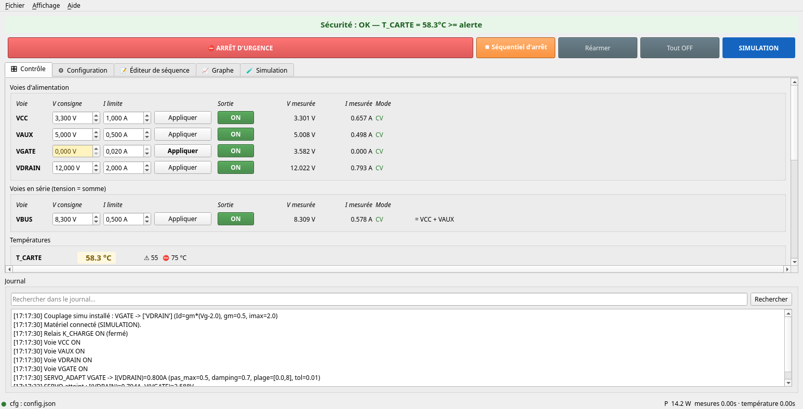
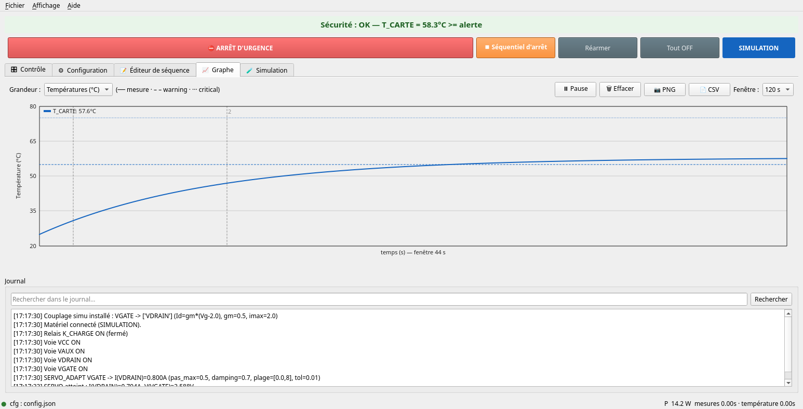
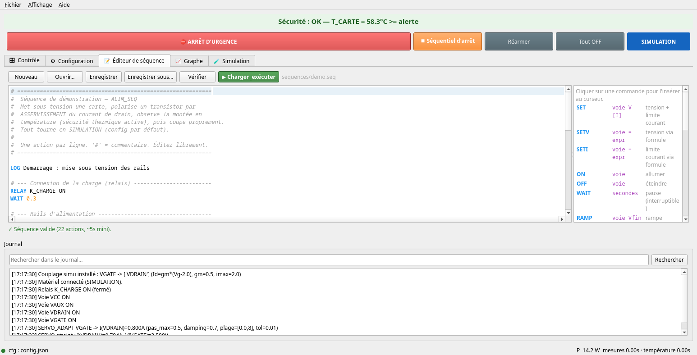

# Séquenceur d'alimentation — HMP4040 + acquisition National Instruments

Application Python pour **séquencer l'alimentation d'une carte électronique** :
pilotage de voies d'alimentation (une ou plusieurs R&S HMP4040 / HMP4030 /
HMP2030 / HMP2020), asservissement de tension sur un courant cible, mesure de
température via un module NI, sécurité thermique, enregistrement et rapport
d'essai. L'**IHM Qt** (PySide6) est l'unique interface.

> **Version installée (Windows)** : lancer `ALIM_SEQ-Setup.exe`. L'installateur
> propose le dossier de données (config, journaux, essais) et démarre en
> **simulation**. Un manuel utilisateur complet est inclus (menu **Aide →
> Manuel utilisateur**, `F1`) et dans [docs/MANUEL_UTILISATEUR.md](docs/MANUEL_UTILISATEUR.md)
> (versions `.docx`/`.pdf` dans [docs/](docs/)).

**Documentation** : [Manuel utilisateur](docs/MANUEL_UTILISATEUR.md) ·
[Architecture](docs/ARCHITECTURE.md) (fonctionnement interne) ·
[Guide du développeur](docs/DEVELOPPEMENT.md) (reprendre le code : setup, recettes, pièges) ·
[Intégrer un driver](docs/GUIDE_DRIVERS.md) · [Contribuer](CONTRIBUTING.md) ·
[Toolchain](docs/TOOLCHAIN.md) (construire les exécutables) ·
[Changelog](CHANGELOG.md) · [Dégraissage du build](packaging/OPTIMISATION.md).

> ⚠️ **Avertissement de sûreté.** Ce logiciel pilote des **alimentations de
> puissance** sur du matériel réel. Ses protections (coupure thermique, arrêts) sont
> **logicielles** et **ne remplacent pas** un dispositif de sûreté matériel ni le
> jugement de l'opérateur. Il est fourni **sans aucune garantie** (voir *Licence*),
> **n'est pas certifié** pour un usage critique, et son utilisation se fait **à vos
> propres risques**. Vérifiez toujours les limites (SOA, câblage, tenue en tension)
> de votre montage. Raccordez les instruments sur un **réseau de banc isolé** (le
> protocole SCPI/TCPIP est sans authentification).

## Aperçu

<p align="center"></p>

> Onglet **Contrôle** — voies d'alimentation et groupe série, surveillance de
> température (seuils), **barre de sécurité permanente** (arrêt d'urgence, séquentiel
> d'arrêt, réarmer), badge de mode et journal. *(scénario de simulation)*

<p align="center"></p>

> Onglet **Graphe** — courbes temps réel commutables **°C / A / V**, seuils
> alerte/critique, **curseur de lecture** des valeurs, repères d'événements, export
> **PNG / CSV**.

<p align="center"></p>

> Onglet **Éditeur de séquence** — coloration syntaxique, **lint en direct**
> (✓/✗ + ligne fautive), auto-complétion (commandes, voies, capteurs) et palette de
> commandes cliquable.

## Fonctionnalités

- Réglage de la **tension** et de la **limite de courant** de chaque voie.
- **Allumage/extinction** de chaque voie.
- **Asservissement** (servo) : monte la tension d'une voie jusqu'à obtenir un
  courant cible mesuré sur une autre voie.
- Mesure de **températures** à partir des tensions lues sur un module NI, avec
  conversion **non linéaire** (table d'étalonnage, polynôme ou thermistance NTC).
- **Sécurité** : seuils d'alerte et critique par capteur. Au seuil critique, la
  séquence est avortée et une **désalimentation ordonnée** (extinction douce des
  voies dans l'ordre inverse) est lancée — pas de coupure brutale qui risquerait
  d'abîmer la carte. Une **coupure dure** n'intervient qu'en dernier recours
  au-delà de `critique + hard_margin_c`.
- **Dossier d'essai autonome** par enregistrement (`logs/essais/…`) : CSV des
  mesures horodatées (températures + V/I de chaque voie + état sécurité), copie de
  la configuration, séquence exécutée, journal et métadonnées — de quoi
  **régénérer un rapport d'essai PDF** depuis ce seul dossier, même des mois plus
  tard (sans dépendance externe : Qt uniquement).
- **IHM à onglets** (Qt/PySide6 — tout se fait depuis l'app) :
  - **Contrôle** : tensions/courants par voie, groupes série, températures
    colorées, lancement de séquence, *Séquentiel d'arrêt*, *Arrêt d'urgence*,
    *Reconnecter*, enregistrement CSV.
  - **Éditeur de séquence** : créer/ouvrir/enregistrer/**vérifier** une séquence
    et la **charger & exécuter** sans passer par un fichier externe.
  - **Configuration** : éditer `config.json` dans l'app, **valider**, enregistrer
    et **appliquer** (recharge le matériel à chaud).
  - **Graphe** : courbe de température en temps réel (QPainter, sans dépendance).
  - Bandeau de sécurité et **cadence réelle** (périodes des boucles) toujours
    visibles ; journal en bas.
- **Séquence** décrite dans un fichier texte, **une action par ligne**.
- **Labels** de voies (ex. `VCC` au lieu de `PSU1 canal 1`).
- **Mode simulation** intégré : tout fonctionne sans matériel (modèle thermique
  où la carte chauffe avec la puissance, pour tester la sécurité).

## Installation

```bash
# Interface graphique (Qt) — requise dans tous les cas, y compris en simulation :
pip install -r requirements-qt.txt
python3 main.py                     # simulation par défaut ("simulate": true)

# Mode MATÉRIEL RÉEL (pilotes en plus) :
pip install -r requirements.txt
```

> `nidaqmx` nécessite le driver **NI-DAQmx** (principalement Windows). En mode
> simulation, ni `pyvisa` ni `nidaqmx` ne sont importés.

> **Windows** : un **installateur** `ALIM_SEQ-Setup.exe` est fourni dans les
> *Releases* (démarre en simulation, aucune dépendance à installer). Pour lancer
> depuis les sources, `run.bat` utilise le `.venv` s'il existe, sinon le Python
> système.

## Lancement

```bash
python3 main.py --config config.json
```

Le champ `"simulate"` de `config.json` choisit le mode :
- `true`  → alimentations et acquisition **simulées** ;
- `false` → matériel **réel** (VISA + NI-DAQmx).

### Interface (Qt / PySide6)

```bash
python3 main.py            # IHM Qt (pip install -r requirements-qt.txt)
```

L'IHM **Qt** offre une **configuration interactive** (onglet *Configuration*) :
- tableaux **Alimentations** / **Voies** / **Groupes** / **Températures**
  (ajout/suppression, dropdowns modèle/alim/canal, case « négative ») ;
- bouton **Scanner VISA** et **Tester la connexion** (ouvre la session + `*IDN?`) ;
- **Assistant convertisseur** : schéma du pont, **courbe live** tension→°C,
  **presets** NTC/PTC, **éditeur de table + import CSV**, thermocouples K/J ;
- onglet **Avancé** = `config.json` **complet**, synchronisé avec les formulaires ;
- **Vérifier / Enregistrer / Appliquer** (recharge le matériel à chaud).

Autres apports de l'IHM Qt : **thème sombre**, **menus** (profils de config :
charger/enregistrer), **barre d'état** (connexion, puissance totale, cadence, REC),
**raccourcis clavier**, onglet **Graphe** (pause, fenêtre, export **PNG/CSV**,
marqueurs de séquence, min/max), **pause/reprise** de séquence, **alerte sonore**,
recherche dans le journal et **mode compact**.

Sécurité et confort d'usage :
- **Barre de sécurité permanente** sous la bannière (visible sur **tous** les
  onglets) : **⛔ ARRÊT D'URGENCE** (raccourci **Ctrl+Shift+X**, **sans
  confirmation** par défaut — activable via *Affichage → Confirmer l'arrêt
  d'urgence*), **Séquentiel d'arrêt**, **Réarmer** (surligné quand la sécurité est
  déclenchée), **Tout OFF**.
- **Aucun gel de l'IHM** : connexion, reconnexion, scan et test VISA s'exécutent
  en tâche de fond (un timeout matériel ne fige plus la fenêtre ; l'arrêt d'urgence
  reste cliquable même pendant une connexion).
- **Saisie de consignes** par champs numériques **bornés** (min/max issus de la
  config, unités, molette neutralisée sauf Ctrl) ; une consigne **modifiée mais
  non appliquée** apparaît en **jaune**.
- **Progression de séquence** (barre k/n + temps restant estimé) et **mode
  pas-à-pas** (case *Pas-à-pas* + bouton *▶| Étape suivante*).
- **Graphe** commutable **Températures / Courants (A) / Tensions (V)**, avec
  **curseur de lecture** au survol et **légende cliquable** (masquer/afficher une
  courbe).
- **Éditeur de séquence** avec **auto-complétion** (commandes, voies, capteurs) ;
  **titre de fenêtre** indiquant le fichier courant et un **●** si modifications
  non enregistrées (confirmation Enregistrer/Ignorer/Annuler à la fermeture).
- **Badge de mode permanent** dans la barre de sécurité : **SIMULATION** (bleu) ou
  **MATÉRIEL RÉEL** (orange), impossible à confondre. Tables de configuration à
  **en-têtes français** (avec unités et tooltips rappelant la clé JSON) ; menu
  **Aide** (raccourcis clavier, référence des commandes de séquence) ; modèle
  **« document »** pour la configuration (charger/enregistrer sous un profil sans
  écraser `config.json`, fichier courant affiché dans la barre d'état).

> Le reste (températures, groupes, sécurité, simulation) s'édite en JSON dans le
> même onglet. Tout passe par la **validation** avant application. ⚠️ Renommer une
> voie ne met pas à jour automatiquement les références dans les **groupes /
> `requires` / `couplings` / fichiers `.seq`** : la validation refusera une
> référence orpheline (à corriger à la main).

## Configuration (`config.json`)

- **`supplies`** : les alimentations, leur **`model`** et leur adresse VISA
  (`resource`). Modèles pris en charge : **HMP4040** (4 voies), **HMP4030** /
  **HMP2030** (3 voies), **HMP2020** (2 voies) — même famille SCPI. Le nombre de
  voies autorisé est validé selon le modèle. *(Ajouter un modèle : écrire un driver
  `BasePSU` et l'enregistrer dans `PSU_MODELS` — [alim_seq/psu.py](alim_seq/psu.py) ;
  l'IHM Qt et la validation le prennent alors en charge automatiquement.)*
- **`channels`** : les voies avec leur **label**, l'alim/canal physique, les
  consignes par défaut et les limites max (tension/courant).
- **`temperatures`** : les capteurs, la voie NI (`ai0`, …), le **convertisseur**
  tension→°C et les seuils `warning` / `critical`.
  - *(optionnel)* **`ref_channel`** + **`ref_tol`** (défaut 0.05) : contrôle de la
    **tension de référence du pont**. La tension **mesurée** de la voie `ref_channel`
    (celle qui alimente le pont, p. ex. `VDD`) est comparée à la tension de
    référence **attendue** ; au‑delà de ±`ref_tol`, le capteur passe en **DÉFAUT**
    et est **exclu de la boucle de sécurité** (mesure non fiable). La référence
    attendue est **`ref_voltage`** (au niveau du capteur, optionnel — pour les
    convertisseurs sans v_ref : `table`, `poly`, `identity`), sinon le `v_ref` du
    convertisseur (NTC/PTC).
- **`groups`** : voies mises en **série** (voir ci-dessous).
- **`safety`** : sécurité thermique.
  - `poll_interval` : période de scrutation (s).
  - `auto_shutdown_on_critical` : lance la désalimentation ordonnée au seuil critique.
  - `shutdown_delay` : temporisation entre chaque extinction de voie (s).
  - `hard_margin_c` : au-delà de `critique + cette marge`, coupure dure immédiate.
  - `shutdown_timeout` *(défaut = durée estimée de la séquence + 30 s)* : budget
    maximal d'une désalimentation ordonnée ; au-delà, **coupure dure** de repli
    (une désalim ne peut jamais laisser des voies alimentées indéfiniment).
  - `shutdown_takeover_wait_s` *(défaut 3.0)* : délai laissé à une séquence
    utilisateur en cours pour s'arrêter avant que la désalim de sécurité ne prenne
    la main ; si elle ne s'arrête pas, on passe directement en coupure dure.
  - `shutdown_sequence` : chemin d'un `.seq` d'arrêt personnalisé (`null` = extinction auto ordonnée, voies dans l'ordre inverse de la config).
  - `auto_reconnect` *(défaut false)* : tente de rouvrir automatiquement la liaison après une perte de communication, avec back-off (plafonné par `reconnect_max_delay`, défaut 30 s).
- **`simulation`** : paramètres du modèle thermique **et** couplages grille→drain
  (mode mock uniquement — voir ci-dessous).

### Voies à tension négative (rails négatives)

Le HMP4040 ne délivre que du **positif** (0–32 V). Pour une rail **négative**
(ex. une grille `VG1` à tension négative), on **câble la voie en inverse** sur
l'alimentation. Côté logiciel, déclare la voie comme négative :

```json
"VG1": { "supply": "PSU1", "channel": 4, "negative": true,
         "default_voltage": 0.0, "max_voltage": 5, ... }
```

Dès lors, tu travailles partout en **valeurs signées** (la tension vue par le
circuit) :
- la plage autorisée devient `[-max_voltage, 0]` ;
- `SET VG1 -2` programme `2 V` de magnitude sur l'alim (voie câblée en inverse) ;
- la **tension mesurée est rapportée négative** dans l'IHM, le CSV et les expressions ;
- `SETV VG2 = (VD/2) + VG1` fonctionne naturellement (VG1 est négatif) ;
- le `SERVO` connaît la polarité : pour une voie négative, ses bornes par défaut
  sont `[-max, 0]` ; `step` reste une **amplitude** (le sens est trouvé seul). Pour
  un dispositif à relation inversée (monter la tension fait baisser le courant),
  ajoute `invert=1` au `SERVO`.

Le courant (limite et mesure) reste en **magnitude positive**, comme l'afficheur
du HMP.

### Voies en série (atteindre une tension plus élevée)

Les 4 sorties d'un HMP4040 sont **isolées (flottantes)** : on peut donc en mettre
plusieurs en série pour additionner les tensions.

**Câblage** : relier la borne `−` de la 1ʳᵉ voie à la borne `+` de la 2ᵉ ; la
charge se branche entre le `+` de la 1ʳᵉ et le `−` de la 2ᵉ. La tension vue par la
charge est la somme ; le **courant est commun** aux deux voies.

**Configuration** — déclarer un groupe dans `groups` :

```json
"groups": {
  "VHV": {
    "members": ["VDD", "VBIAS"],
    "mode": "series",
    "split": "equal",        // "equal" = réparti à parts égales ; "fill" = remplit la 1ère puis la 2ème
    "max_voltage": 18.0,     // optionnel (défaut = somme des max des membres)
    "max_current": 1.0       // optionnel (défaut = min des max des membres)
  }
}
```

> `max_current` du **groupe** est réellement **appliqué** : régler le courant du
> groupe borne la consigne à cette limite (qui peut être **plus basse** que celle
> des voies membres) avant de la répartir sur chaque membre.

Le groupe devient une **voie logique** pilotable par son label dans l'IHM et dans
les séquences, exactement comme une voie physique :

```
SET VHV 18 0.5     # 18 V au total, 0.5 A de limite (commune aux 2 voies)
ON VHV
SERVO_ADAPT VHV VCC 0.4  # on peut aussi asservir un groupe
```

- La **tension demandée est répartie** entre les voies (mode `equal` :
  équilibré, avec débordement automatique si une voie atteint son max).
- La **limite de courant** est appliquée identique sur chaque voie (série).
- L'**IHM** affiche le groupe (consigne/mesure totale) **et** chaque voie
  physique, dans une section « Voies en série ».
- ⚠️ Vérifie la tenue en tension des sorties par rapport à la masse de ton
  montage, et ne pilote pas une voie membre individuellement pendant qu'elle est
  utilisée en groupe.

### Charges simulées / voies en CC (mode mock)

En simulation, chaque voie alimente une **charge résistive** : `I = V / R`. Si
`V / R > limite de courant`, la voie passe en **CC** (la tension chute) — c'est
souvent ce qu'on voit quand la charge par défaut est trop faible pour une voie à
faible limite de courant (ex. une grille à 0.05 A).

Pour régler ça, fixe la charge par voie dans `simulation.loads` (ohms) :

```json
"simulation": {
  "loads": {
    "VG2": 1000000,   // haute impédance -> reste en CV à ~0 A
    "VDD": 12         // R = V/I_attendu pour modéliser une vraie charge (6V/0.5A)
  }
}
```

- **Rester en CV** : `R` grand (ex. `1e6`) → courant ≈ 0.
- **Modéliser une charge** : `R = V / I_attendu`.
- Voies pilotées par `couplings` (drains / grille) : la charge est **ignorée**
  (elles sont en source de courant).

La valeur par défaut (si non listée) est dans `MockHMP4040.DEFAULT_LOADS`
([alim_seq/psu.py](alim_seq/psu.py)). Ce modèle n'existe **qu'en simulation**.

### Couplage grille→drain en simulation (tester un SERVO sans matériel)

En mode réel, asservir une grille (`SERVO VG1 VD …`) fonctionne car la tension de
grille pilote le courant de drain. En **simulation**, les voies sont par défaut
indépendantes, donc un tel `SERVO` ne converge pas. Pour tester la logique avant
le banc, on déclare un **couplage** dans `simulation.couplings` :

```json
"simulation": {
  "couplings": [
    { "gate": "VG1", "drains": ["VD"], "vth": 2.0, "gm": 0.005, "imax": 0.02 }
  ]
}
```

Modèle simplifié (transconductance) : le courant de drain imposé aux voies
`drains` vaut `Id = gm * (V_grille − vth)`, borné à `[0, imax]` ; la grille est
rendue haute impédance (courant ≈ 0). `drains` accepte un label de groupe série
(ex. `VD`) — le courant traverse alors chaque voie membre. **Sans effet en mode
réel.** (La configuration livrée par défaut est neutre — voies génériques `CH1`/
`CH2`, sans couplage ; ce montage est un exemple à adapter à votre banc.)

### Dossier d'essai et enregistrement CSV

L'IHM permet de démarrer/arrêter l'enregistrement (bouton ⏺ ou **Ctrl+R**) ; il
démarre aussi automatiquement au lancement d'une séquence (si la case est cochée).
Un petit dialogue facultatif demande le **nom de l'essai** et l'**opérateur** (les
deux facultatifs ; l'opérateur est mémorisé).

Chaque enregistrement crée un **dossier d'essai autonome** — l'ancien emplacement
unique `logs/mesures_*.csv` a disparu au profit de ce dossier :

```
logs/essais/AAAAMMJJ_HHMMSS[_<nom>]/
├── mesures.csv    # le CSV des mesures (voir colonnes ci-dessous)
├── config.json    # copie EXACTE de la configuration active (+ empreinte SHA-256)
├── sequence.seq   # texte exact de la séquence exécutée (absent si pilotage manuel)
├── journal.log    # événements du contrôleur pendant l'essai
├── essai.json     # métadonnées : version, mode, horodatages, empreintes, issue…
├── rapport.html   # rapport régénérable (voir plus bas)
└── rapport.pdf
```

L'intérêt : un tiers peut **régénérer le rapport PDF depuis ce seul dossier**, sans
l'application ouverte sur l'essai, y compris des mois plus tard — le rapport se
génère toujours depuis les artefacts, jamais depuis l'état vivant de l'IHM.

**Colonnes de `mesures.csv`**, par ligne : horodatage, temps écoulé, puis pour
chaque capteur **`<nom>_C` (°C) et `<nom>_V`** (tension NI **brute**, avant
conversion — filet de sécurité si l'étalonnage est à revoir *a posteriori*), puis
pour chaque voie `Vset, Iset, Vmeas, Imeas, out`, et l'état de sécurité. La colonne
`_V` n'est renseignée qu'avec le **module NI réel** (vide/`nan` en simulation). Le
fichier est *flushé* à chaque ligne (exploitable en direct, tableur ou pandas). Le
format n'évolue que par **ajout de colonnes en fin de ligne** (rétrocompatible).

**`essai.json` — issue de l'essai** (champ `issue.issue`) :

| Valeur | Signification |
|---|---|
| `termine` | Arrêt propre (fin de séquence normale ou arrêt manuel de l'enregistrement) |
| `arret_utilisateur` | Séquence interrompue par l'opérateur |
| `declenchement_securite` | Déclenchement de sécurité (trip, coupure dure, perte de comm) — `cause` renseignée |
| `en_cours` | Essai non finalisé (application fermée en cours d'essai) |

Un déclenchement de sécurité **ne ferme pas** l'enregistrement : il continue de
capter la désalimentation (le plus précieux pour l'analyse) ; l'issue est marquée
et les événements de sécurité horodatés sont ajoutés à `essai.json`.

### Rapport d'essai (HTML → PDF)

Le rapport **raconte l'essai**, il ne fait pas que l'agréger. Il reprend :
- **en-tête** avec logo et **synthèse** (issue en clair et en couleur — rouge pour
  un déclenchement de sécurité ; nombre de points, cadence effective, taille du CSV) ;
- **conclusion de l'opérateur** (champ libre facultatif, persisté dans `essai.json`
  et rééditable) et une **zone de visa** (signature manuelle) ;
- **graphiques** V/I et températures avec seuils, sur lesquels sont **matérialisés
  les événements** du journal (LOG de séquence en pointillé gris, événements de
  sécurité en trait rouge), recalés sur l'axe des temps ;
- en cas de déclenchement, un **graphique de zoom ±30 s** autour du trip (capteur en
  cause en trait épais, seuils alerte/critique, zone critique ombrée) — la pièce
  maîtresse de l'analyse d'incident ;
- **statistiques enrichies** : par voie (min/max/moy V-I, **temps en limitation de
  courant**, consignes début/fin), par capteur (min/max/moy, **dépassements** du
  seuil d'alerte et durées cumulées au-dessus de l'alerte et du critique) ;
- **chronologie** des événements et **annexes** : séquence exécutée, et configuration
  en **tableaux lisibles** (voies, capteurs) puis JSON complet.

Mise en forme : **une page par partie**, tableaux centrés à en-têtes colorés,
**pied de page paginé** (`ALIM_SEQ v… — page X / N`) et **en-tête courant** (nom
d'essai), nombres au **format français**. Le dossier d'essai reste **autonome**
(logo et graphiques copiés dedans, aucune référence externe). Le rapport **n'émet
aucun verdict de conformité** : la conclusion est celle de l'opérateur.

- **Fin d'enregistrement** : si l'option *Affichage → Générer le rapport en fin
  d'essai* est cochée (par défaut), la conclusion est proposée puis le rapport est
  généré ; le PDF est signalé dans le journal.
- **Déclenchement de sécurité** avec essai en cours : le rapport est généré
  **automatiquement** dès la fin de la désalimentation (sans dialogue).
- **Régénération à la demande** : *Fichier → Générer un rapport d'essai…* liste les
  dossiers de `logs/essais/` (nom, issue) et régénère avec saisie/édition de la
  conclusion. *Aide → Où sont mes fichiers ?* ouvre `logs/essais/` dans l'explorateur.

Le PDF est produit par **ReportLab** (pur Python, **sans Qt**), les graphiques par
**matplotlib** (backend Agg, depuis `mesures.csv`). La couche données et le HTML
d'aperçu navigateur sont **pur Python** (`alim_seq/rapport.py`, testable sans aucune
IHM) — voir [requirements-qt.txt](requirements-qt.txt). Si matplotlib est absent, le
rapport est tout de même généré (sans les graphiques).

### Liaison avec les HMP4040 (USB / LAN) — choix et fiabilité

Le champ `supplies[].resource` (chaîne VISA) choisit le transport. Retours du banc :

| Liaison | `resource` | Verdict |
|---|---|---|
| **LAN socket** (recommandé) | `TCPIP0::<ip>::5025::SOCKET` | robuste, rapide |
| LAN VXI-11 | `TCPIP0::<ip>::inst0::INSTR` | peut **timeouter** selon la VISA |
| **USB-TMC** | `USB0::0x0AAD::0x...::<série>::INSTR` (alim réglée en **TMC**) | OK |
| USB **CDC** (VCP) | port COM virtuel | **très lent** — à éviter |

> ⚠️ En USB, règle l'alim en **TMC**, pas en **CDC** : le CDC émule un port série
> et chaque commande fait un aller-retour lent (aggravé par le `*OPC?`).

Le driver est durci pour ces transports :
- **terminaisons `\n`** explicites en lecture/écriture (indispensable en socket
  brut, sinon chaque requête bloque jusqu'au timeout) ;
- **purge du buffer à la connexion** (`_safe_clear`) : corrige l'« inversion »
  tension/courant en TMC, due à une réponse restée en attente après un run
  interrompu (la 1ʳᵉ lecture la récupérait et tout se décalait d'un cran) ;
- **`_query` avec une reprise** (purge + nouvel essai) contre les désync /
  `input protocol violation` sporadiques ;
- option `visa_query_delay` (racine de `config.json`, défaut `0`) : mets `0.02`
  si une alim renvoie des `input protocol violation`.

### Note matériel — `*OPC?` sur les HMP4040

Le driver réel envoie `*OPC?` après chaque commande de réglage (sélection de
voie, `VOLT`, `CURR`, `OUTP`). Sur les HMP, cela bloque jusqu'à ce que l'alim ait
terminé de traiter la commande : c'est le moyen fiable d'éviter qu'une commande
soit « ratée » quand on en enchaîne plusieurs rapidement (comportement que tu
avais observé). Le couple `write`+`*OPC?` garde aussi les E/S **équilibrées**
(autant de lectures que d'écritures), ce qui évite tout décalage du buffer.
Désactivable via `HMP4040(..., use_opc=False)` si besoin.

### Convertisseurs de température

Le module NI mesure une **tension** ; le champ `converter.type` choisit la loi :

| type        | paramètres                                   | usage |
|-------------|----------------------------------------------|-------|
| `table`     | `points: [[V, °C], …]`                        | courbe d'étalonnage interpolée (non linéaire) |
| `poly`      | `coeffs: [c0, c1, c2, …]`                     | T = c0 + c1·V + c2·V² + … |
| `ntc`       | `r_series, v_ref, r0, t0, beta, pullup_to_vref` | thermistance NTC / CTN (équation Beta) |
| `ptc`/`rtd` | `r_series, v_ref, r0, t0, alpha, pullup_to_vref` | thermistance PTC/CTP **linéaire** ou RTD PT100/PT1000 |
| `identity`  | —                                            | la valeur lue est déjà en °C (ex. thermocouple) |

#### Exemple NTC (thermistance) détaillé

Câblage par pont diviseur (`pullup_to_vref: true`), l'ADC mesure le point milieu :

```
v_ref ──[ r_series ]──┬──[ NTC ]── GND
                      │
                    ai0  (tension mesurée = aux bornes de la NTC)
```

```json
"T_CPU": {
  "channel": "ai0",
  "converter": {
    "type": "ntc",
    "r0": 10000,        // résistance nominale de la NTC (Ω) à t0
    "t0": 25,           // température de référence (°C)
    "beta": 3950,       // coefficient B de la NTC (K), datasheet (ex. B25/85)
    "r_series": 10000,  // résistance fixe du pont (Ω)
    "v_ref": 3.3,       // tension d'alimentation du pont (V)
    "pullup_to_vref": true,
    "fault_margin": 0.02 // capteur débranché/court-circuit : voir ci-dessous
  },
  "warning": 70, "critical": 85
}
```

> **Détection de capteur débranché (`fault_margin`, défaut 0.02).** Une NTC/PTC
> **débranchée** ou en **court-circuit** fait coller la tension du pont à un rail
> (0 ou `v_ref`). Si la tension mesurée s'approche d'un rail à `fault_margin`
> (fraction de `v_ref`) près, la conversion renvoie **NaN**, classé **DÉFAUT** —
> **jamais** une valeur « très froide » plausible qui masquerait la panne. Mettre
> `0` désactive la détection ; dans ce cas, définis au moins `valid_min`/`valid_max`
> (sinon la configuration est **refusée** : aucun garde-fou de débranchement).

Les **4 paramètres NTC** (`r0`, `t0`, `beta`) viennent de la datasheet de ta
thermistance ; `r_series` et `v_ref` de ton montage. Avec l'exemple (NTC 10 kΩ
B3950, série 10 kΩ, 3.3 V), le point milieu vaut **1.65 V à 25 °C**, **0.49 V à
70 °C**, **0.32 V à 85 °C** (la tension *baisse* quand ça chauffe). Mets
`pullup_to_vref: false` si la NTC est côté `v_ref` et `r_series` côté GND.

> Pas de NTC sous la main pour t'étalonner ? Utilise plutôt le convertisseur
> `table` avec ta courbe tension→°C mesurée.

#### Exemple CTP / PTC (et RTD PT100/PT1000)

⚠️ Pour une **CTP (PTC)**, la résistance **augmente** avec la température :
l'équation Beta de la NTC **ne s'applique pas**. Utilise le convertisseur `ptc`
(loi linéaire `R(T) = r0·(1 + alpha·(T − t0))`), même câblage en pont diviseur :

```json
"T_RTD": {
  "channel": "ai2",
  "converter": {
    "type": "rtd",      // ou "ptc"
    "r0": 1000,         // PT1000 : 1000 Ω à t0
    "t0": 0,            // °C de référence
    "alpha": 0.00385,   // coeff. de température (/°C) — PT100/PT1000 : 0.00385
    "r_series": 1000,   // résistance fixe du pont (Ω)
    "v_ref": 3.3,
    "pullup_to_vref": true,
    "fault_margin": 0.02 // idem NTC : tension collée à un rail -> DÉFAUT (débranché)
  },
  "warning": 60, "critical": 80
}
```

- **PT100** : `r0: 100`, `alpha: 0.00385`. **PT1000** : `r0: 1000`.
- **Silistor type KTY** : prends `alpha` dans la datasheet (~0.007–0.008/°C).
- Pour une CTP **très non linéaire**, préfère `table`. Une **CTP céramique à
  seuil** (BaTiO₃) sert à la protection, **pas** à la mesure de température.

#### Désactiver la surveillance de température

Pour utiliser l'app **sans aucune mesure de température** (et **sans le module
NI**), mets simplement :

```json
"temperatures": {}
```

Dans ce cas : pas de boucle de sécurité thermique, le module NI n'est ni connecté
ni interrogé, l'onglet Températures et le graphe restent vides. Tu gardes tout le
reste (pilotage des voies, séquences, asservissement, sécurité de communication).

#### Capteurs conditionnés à une voie (`requires`)

Si un capteur n'est alimenté/conditionné qu'une fois une voie allumée (ex. les
thermocouples lus seulement après `VDD`), déclare-le :

```json
"T_BOARD": { "channel": "ai1", "requires": ["VDD"], "warning": 60, "critical": 80, ... }
```

Tant qu'une voie de `requires` n'est pas ON, le capteur est **« en attente »** :
sa valeur est jugée non fiable, **affichée grisée et exclue de la sécurité**
(pas de coupure intempestive sur une mesure parasite avant mise sous tension).
Dès que la/les voie(s) requise(s) sont ON, le capteur protège normalement. Sans
ce garde-fou, une entrée NI non alimentée (≈ 0 V) serait convertie en température
aberrante (ta table donne `0.2 V → 100 °C`) et déclencherait un faux arrêt.

> La conversion réelle dépend de ton capteur. Remplace les valeurs d'exemple
> (`config.json`) par ta vraie courbe / tes coefficients. Pour ajouter une loi,
> écris une sous-classe dans [alim_seq/temperature.py](alim_seq/temperature.py).

## Format des séquences (`sequences/*.seq`)

Une **action par ligne**. `#` ou `//` = commentaire. Mots-clés insensibles à la
casse ; labels sensibles à la casse.

| Commande | Effet |
|----------|-------|
| `SET <voie> <V> [A]` | règle tension (et limite courant) |
| `VOLTAGE <voie> <V>` / `CURRENT <voie> <A>` | règle un seul paramètre |
| `SETV <voie> = <expression>` | règle la tension via une **formule** (consigne calculée) |
| `SETI <voie> = <expression>` | idem pour la limite de courant |
| `ON <voie>` / `OFF <voie>` | allume / éteint |
| `WAIT <s>` | pause (interruptible) |
| `RAMP <voie> <V0> <V1> <durée_s> [pas]` | rampe de tension — `[pas]` = **nombre de pas** (entier ≥ 2), pas une taille de pas |
| `SERVO_LIN <voie_réglée> <voie_mesurée> <I_cible> [step= min= max= tol= timeout= settle= invert=]` | asservissement, **pas fixe** (`SERVO` = alias) |
| `SERVO_ADAPT <voie_réglée> <voie_mesurée> <I_cible> [step(plafond)= damping= …]` | asservissement, **pas adaptatif** (sécante/Newton : rapide loin, fin près) |
| `WAIT_CURRENT <voie> <op> <val> [timeout=]` | attend une condition de courant |
| `WAIT_TEMP <capteur> <op> <val> [timeout=]` | attend une condition de température |
| `LOG <message>` | trace dans le journal |
| `ALL_OFF` | coupe toutes les voies |
| `REPEAT <n>` … `END` | répète n fois le bloc (imbrication possible) |

`op` ∈ `<  <=  >  >=  ==`. Voir [sequences/demo.seq](sequences/demo.seq).
L'éditeur affiche le **nombre d'actions et la durée estimée** à la vérification ;
l'exécution peut être **mise en pause / reprise** (les `WAIT` sont gelés).

> **Validation à l'analyse.** La **Vérification** contrôle désormais aussi les
> **arguments numériques** (tension/courant/durée), le signe attendu, le format des
> clés `clé=valeur` (liste blanche par commande) et, pour `RAMP`, que `[pas]` est
> bien un **entier ≥ 2**. Une séquence avec un argument invalide est rejetée
> **avant** toute action matérielle.

> **Stop refusé pendant une désalimentation de sécurité.** Le bouton **Stop**
> arrête une séquence lancée par l'opérateur, mais il est **ignoré** pendant une
> **désalimentation de sécurité** (déclenchée par la protection thermique/matériel) :
> celle-ci va jusqu'au bout de l'extinction des voies. Seul l'**arrêt d'urgence**
> (coupure dure) peut l'interrompre — et il coupe alors tout immédiatement.

#### Consignes calculées (`SETV` / `SETI`)

On peut régler une voie à partir d'une **formule** dépendant des autres voies —
typiquement après un `SERVO` qui a trouvé une valeur :

```
SERVO_ADAPT VG1 VDD 0.005 max=5  # VG1 réglé automatiquement (pas adaptatif)
SETV VG2 = (VD/2) + VG1          # VG2 calculé à partir de VD (groupe) et VG1
```

Dans une expression :
- un **nom de voie nu** (`VG1`, `VD`, …) vaut sa **consigne de tension** courante
  (pour un groupe série, la tension totale) ;
- fonctions disponibles : `V(x)`/`Vset(x)` (consigne tension), `Vmeas(x)`
  (tension mesurée), `Iset(x)` (limite courant), `I(x)`/`Imeas(x)` (courant mesuré) ;
- opérateurs `+ - * /`, parenthèses, nombres. Toute autre construction est
  refusée (évaluation sûre, pas de code arbitraire).

La valeur calculée est bornée par les `max_voltage`/`max_current` de la voie.

## Tests

Suite automatisée (mode simulation, sans matériel) :

```bash
pip install -r requirements-dev.txt
python -m pytest
```

Couvre les convertisseurs de température, l'évaluateur d'expressions, la
validation de configuration, le parsing des séquences, et le contrôleur
(polarité, groupes série, asservissement, consignes calculées, validité/défaut
capteurs, CV/CC, coupures de sécurité). Non requis pour exécuter l'application.

Un **journal applicatif** est aussi écrit dans `logs/alim_seq.log` (rotation) en
plus du CSV de mesures.

## Empaquetage (build Windows)

L'exécutable Windows est construit par PyInstaller en mode **onedir**
(`dist/ALIM_SEQ/`), empaqueté dans un installateur **Inno Setup**. Le build est
**dégraissé** : matplotlib **backend Agg** seul (les backends interactifs, `tkinter`,
l'OpenGL logiciel, les traductions et plugins Qt inutiles sont exclus ; `mpl-data`
filtré en gardant la police DejaVu Sans). Gain ≈ **−23 %** (180 → 139 Mio), sans
changer le rendu. Détail des exclusions, mesure reproductible (`ALIM_SLIM=0`) et
**check-list de validation Windows** : [packaging/OPTIMISATION.md](packaging/OPTIMISATION.md).

La **production des exécutables** (déclenchement du build, VM à la demande) est
décrite dans [docs/TOOLCHAIN.md](docs/TOOLCHAIN.md) ; l'historique des versions dans
[CHANGELOG.md](CHANGELOG.md).

## Architecture

```
main.py                → point d'entrée / arguments
config.json            → configuration (voies, capteurs, seuils, mode)
alim_seq/
  config.py            → chargement + validation
  temperature.py       → convertisseurs tension→°C (table/poly/ntc/identity)
  instrument.py        → abstraction des appareils par capacités + registre unifié
  psu.py               → HMP4040 (SCPI), MockHMP4040 (capacités SourceTension+MesureVI)
  daq.py               → NIDaq (nidaqmx), MockDAQ (modèle thermique)
  relay.py             → relais / actionneurs (capacité Actionneur, MockRelay)
  controller.py        → orchestration, boucle de mesure, sécurité, servo
  sequencer.py         → analyse fichier + exécution interruptible
  gui_qt/              → IHM Qt/PySide6 (unique interface)
  rapport.py           → rapport d'essai (HTML + PDF ReportLab)
docs/MANUEL_UTILISATEUR.md → manuel utilisateur (aussi dans l'app : Aide → Manuel)
sequences/demo.seq  → séquence d'exemple
```

Tous les accès matériels sont sérialisés derrière un unique verrou. La boucle de
mesure tourne en tâche de fond et déclenche l'arrêt d'urgence ; le séquenceur
s'exécute dans son propre thread, interruptible à tout instant.

## Robustesse en conditions réelles

- **Connexion tolérante aux pannes** : si une VISA/alim/carte NI est absente au
  démarrage, l'IHM ne plante pas — elle s'ouvre en mode déconnecté avec un
  message, et un bouton **« Reconnecter »** ouvre des sessions neuves une fois le
  problème corrigé.
- **Boucle de sécurité découplée** : les **températures** sont lues à cadence
  rapide (`safety.temp_poll_interval`, défaut 0,2 s) pour la sécurité, tandis que
  les **mesures V/I** des alims (plus lentes en SCPI) tournent à
  `safety.poll_interval`. La protection thermique reste réactive même si les
  alimentations sont lentes.
- **Perte d'instrument en cours d'essai** : après `safety.comm_fail_limit` échecs
  consécutifs,
  - perte de la **mesure de température** (NI) alors que des voies sont ON →
    **désalimentation douce** (les alims répondent encore), si
    `shutdown_on_temp_lost` ;
  - perte de **communication alim** → **arrêt d'urgence** (best effort).
- **Capteur en défaut** : une mesure hors `[valid_min, valid_max]` (ou NaN, ex.
  thermocouple débranché) marque le capteur **DÉFAUT** (violet), l'exclut de la
  surveillance, et peut déclencher la désalimentation si
  `shutdown_on_sensor_fault`.
- **Défaut matériel HMP** : l'**OVP**, le **fusible électronique** ou la
  **surchauffe** d'une voie sont lus sur le registre d'état du HMP
  (`STAT:QUES:INST:ISUM<n>:COND?`, bits 4/9/10) et affichés sur la voie
  (`OVP`/`FUSE`/`OTP`) + bannière. Journalisé ; désalimentation si
  `shutdown_on_hw_fault`. Utile pour diagnostiquer une OVP/fusible verrouillé
  (ex. après un mauvais câblage en série) : c'est souvent **récupérable** par un
  réarmement, pas un dommage matériel.
- **CV/CC** : lu directement sur le **registre d'état du HMP**
  (`STAT:QUES:INST:ISUM<n>:COND?` — bit 0 = CC, bit 1 = CV, conforme au manuel),
  activé par défaut (`cc_status: true`). Si le firmware ne répond pas, repli
  automatique sur l'**inférence** V/I (limite de courant atteinte et/ou tension
  mesurée nettement sous la consigne) avec **hystérésis**. Mets `cc_status` à
  `false` pour économiser une requête SCPI par voie (latence).

## Sécurité — note importante

Le mode simulation permet de valider la logique (la sécurité thermique se
déclenche bien). **Avant tout essai réel**, vérifie les adresses VISA, le câblage
NI, la loi de conversion de tes capteurs et les seuils de température.

- *Séquentiel d'arrêt* : extinction **douce** ordonnée (recommandé en usage normal).
- *Arrêt d'urgence* : coupure **brutale** immédiate de toutes les voies (confirmation demandée).
- La sécurité thermique utilise la désalimentation ordonnée ; la coupure brutale
  n'est automatique qu'au-delà de `critique + hard_margin_c`.
- *Réarmer* : lève le verrou de sécurité une fois le défaut traité.

## Licence

Distribué sous licence **GNU General Public License v3.0** — voir [LICENSE](LICENSE).

En résumé : vous êtes libre d'utiliser, d'étudier, de modifier et de redistribuer
ce logiciel ; toute version distribuée (modifiée ou non) doit rester **ouverte**
sous la même licence GPL-3.0 et être accompagnée de son code source. Le logiciel
est fourni **sans aucune garantie**.
